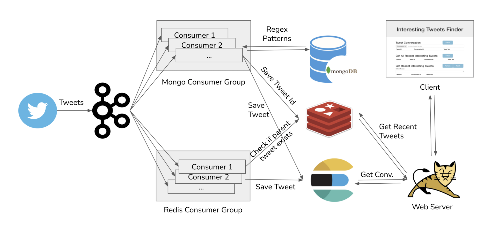

# Interesting Tweets Finder

## Description
Interesting Tweets Finder is a simple application that shows how various microservices can interact together to build
a big, powerful, persistent, reliable and scalable distributed system with java spring framework. 

## Technology Stack


## Architecture



## Usage

1. Set up a MongoDB database, and a Twitter developer account.
2. Create a credentials.properties file in src/main/resources directory, with the following properties:

```
TWITTER_BEARER_TOKEN=YOUR_TWITTER_BEARER_TOKEN_HERE     # Change This
MONGODB_USER=YOUR_MONGO_DB_USER_ID                      # Change This
MONGODB_PASSWORD=YOUR_MONGO_DB_PASSWORD                 # Change This
MONGODB_HOST=MONGO_DB_HOST_AND_PORT_ADDRESS             # Change This
MONGODB_DATABASE_NAME=twitter
ES_USER_NAME=elastic
ES_PASSWORD=password
```

3. Move to the root directory of the app and run the following commands-

```
$ docker-compose up -d
$ ./gradlew assemble  
$ java -jar build/libs/interesting-tweets-finder-0.0.1-SNAPSHOT.jar -Xms256m -server
````

4. Interact with the application at <a href="http://localhost:8080/api/index.html"> localhost:8080/api/index.html</a>